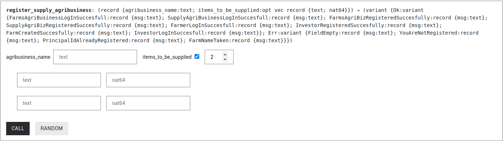

# INVESTA FARM CANISTERS
Welcome to Investa Farm Canisters. This repository contains the different backend logic for Investa Farm Site 

## Getting started: 
Clone the repository
```
git clone https://github.com/Investa-Farm/investafarm-canisters.git
```

Ensure you have the following dependencies installed in your environment
```
1. Node js 18 
2. dfx 
3. Rust 
```

You can check out the following guides on how to set up your environment and install the required dependencies: 
1. Guide 1: [Link](https://internetcomputer.org/docs/current/developer-docs/getting-started/install/) 
2. Guide 2: [Link](https://docs.google.com/document/d/1OW3oT8F9pumYg3hmybrHFB8T0VpDwDgRVE5PfVkHFJI/edit?usp=sharing)

## Canister Architecture: 
A detailed explanation of the canister's architecture can be found over [here](https://docs.google.com/document/d/1EGoq2N2qiWPbeFbTOVr1LSLiaspwg4ROMYodqY8TkfU/edit?usp=sharing)

A detailed explanation of the user flow can be found ove [here](https://docs.google.com/document/d/115tZG5oz6jwoKw-9cYmaolUvrzHONh1ILVRjYcSQYx8/edit?usp=sharing)

The architecture is divided into different sections: 

1. Canister one: responsible for entity management and ordering of items from supply agri business 
2. Canister two: responsible for approval of the different entities that have registered
3. Canister three: this will be the payments smart contract

### 1. Canister One: ``src/canister_one``
It contains the following logic:
1. Entity Management: Registration, Updating and Deletion of the different entities in the system (i.e farms, Investors, Farms Agri Business, Supply Agri Business). The logic for this is located in the ``src/entitymanagement.rs`` 
2. Ordering of items from supply agri business: Farmers will be able to order the different items that are being sold by the different supply agri businesses that have registered in the system. 

### 2. Canister Two: ``src/canister_two``
Responsible for approval of the different entities that have registered once they go through the KYC 

### 3. Canister Three: ``src/canister_three``
Responsible for payments 

## Running the code: 
1. Step 1: Starting the local replica: 
```
dfx start --clean --background
```

2. Step 2: Generating the candid file: 
```
For canister 1: 
./canister_one_did.sh && dfx generate canister_one

For canister 2:
./canister_two_did.sh && dfx generate canister_two

For canister 3:
./canister_three_did.sh && dfx generate canister_three
```

3. Step 3: Deploying the canister locally 
```
For canister 1: 
dfx deploy canister_one 

For canister 2: 
dfx deploy canister_two 

For canister 3: 
dfx deploy canister_three
```

## Task 1: Gerald 
Your task will be completing the ordering items from supply agri business logic 

This is the current user flow for the ``supply agri business`` entity: 
```
register via register_supply_agribusiness() function -> agri business gets approved in the 2nd canister (not yet implemented) -> farmers can now order items from the supply agri businesses 
``` 

Your task will be completing the ``ordering items from the supply agri business`` logic

When a supply agri business registers, they have the option of filling in the different items they have during registration or they can just fill them later once they've logged into the site (The option of filling it later hasn't been implented yet)



For the item section, they'll be filling in the ``item name`` and the ``item price`` 

The logic of the code will be at the ``canister_one/src/supplymanagement.rs`` directory  

You'll switch to the ``supply-management`` branch in order to start writing the code logic

This is a summary of the ``farmer user flow``: 
```
1. farmer registers in the platform -> 2. farmer gets verified once KYC is done (not implemented) -> 3. farmer asks for a loan (not implemented yet) -> 4. once loan is received farmer starts requesting for items from the supply agri business
```

Ideally we'll just skip to step 4 as we work on logic of step 2 and 3 

Here's a summary of the ``items to be supplied flow``: 
```
1. Farmer selects the item they'd like to receive from the supply agri business -> 2. Item gets gets marked as pending until the supply agri business confirms it -> 3. Once the item is confirmed, it triggers a function in the payments smart contract that's supposed to transfer the funds from the farmer to the supply agri business (this hasn't been implemented yet, so you'll just skip) -> 4. Item now gets marked as comlpeted and its quantity reduced from the supply agri business and moved to the farmer 
``` 

Deadline: Tuesday April 17th 

## Task 2: Steve 
1. Complete login function: complete login function that checks whether someone has registered before logging into the site 

2. Complete farmer user flow: 
```
1. Farmer registers -> 2. Farmer gets verified via the admin panel -> 3. Farmer asks for a certain amount of loan -> 4. Farmer receives loan amount from Investor -> 5. Farmer selects Items they'd like to receive from the supply agri business -> 6. Once the farmer repays a loan they can ask for a new loan 
```

